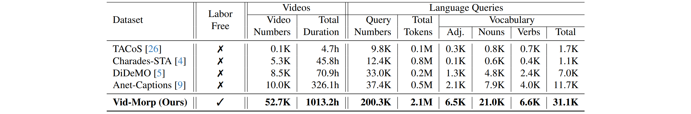

# Vid-Morp: Video Moment Retrieval Pretraining from Unlabeled Videos in the Wild

<!--
**TLDR:**
We propose a novel pretraining dataset and algorithm for video moment retrieval that effectively reduces annotation costs.


## TLDR 
1. To reduce manual annotation costs for grounding, we introduce a large scale dataset collected with minimal human involvement for video moment retrieval pretraining.
2. We propose the ReCorrect algorithm
-->


We propose a new dataset and algorithm for video moment retrieval pretraining, which effectively relieves the high cost of human annotations.

Our experiments highlight that:
- Compared to the fully supervised approach SimBase, Our ReCorrect achieves **81.3%** and **86.7%**  of its performance  in  **zero-shot** and **unsupervised** settings.
- This narrow performance gap underscores the potential of our Vid-Morp dataset to address the critical challenge of VMR's **heavy reliance on manual annotations.**

# Quick Start

To run the code, use the following command, which integrates the evaluation process for 1) zero-shot, 2) unsupervised, and 3) fully-supervised setting.
```shell script
python main.py --cfg ./experiment/charades/recorrect_eval_configs_on_ZeroShot+Unsup+Full.json --eval
```

*You do not need any extra downloading to run the code*, as the repository is self-contained with necessary features and checkpoints. 
1. CLIP features are available in the `data/charades/feat` directory.
2. Pre-trained checkpoints are located in `ckpt/charades`
    - `zero_shot.ckpt`: zero-shot model.
    - `unsup.ckpt`: unsupervised model.
    - `full_sup.ckpt`: fully supervised model.
    
**Fully Supervised Setting**

| Method | R\@0.1 | R\@0.2 | R\@0.3 | mIoU |
| ---- | ---- | ---- | ---- | ---- |
| SimBase | 77.77 | 66.48 | 44.01 | 56.15 |
| **ReCorrect (Ours)** | **78.55** | **68.39** | **45.78** | **57.42** |
<p>&nbsp;</p>

**Zero-Shot Setting**

| Method | R\@0.1 | R\@0.2 | R\@0.3 | mIoU |
| ---- | ---- | ---- | ---- | ---- |
| ReCorrect | 66.54 | 51.15 | 28.54 | 45.63 |
| **% of SimBase** | **85.6%** | **76.9%** | **64.8%** | **81.3%** |
<p>&nbsp;</p>

**Unsupervised Setting**

| Method | R\@0.1 | R\@0.2 | R\@0.3 | mIoU |
| ---- | ---- | ---- | ---- | ---- |
| ReCorrect | 70.96 | 54.42 | 31.10 | 48.66 |
| **% of SimBase** | **91.2%** | **81.9%** | **70.7%** | **86.7%** |
<p>&nbsp;</p>


# Motivation

<!--
<div align="center">
    
</div>
-->


A crucial challenge in video moment retrieval is its heavy reliance on extensive manual annoations for training. To overcome this, we introduce a large scale dataset for Video Moment Retrieval Pretraining (Vid-Morp), collected with minimal human involvement. Vid-Morp comprises over 50K in-the-wild videos and 200K pseudo training samples. Models pretrained on Vid-Morp significantly relieve the annotation costs and demonstrate strong generalizability across diverse downstream settings.

# Dataset

### Comparison to Existing Dataset




## Citation
If you use our code or models in your research, please cite with:
```
@article{bao2024vidmorp,
title={Vid-Morp: Video Moment Retrieval Pretraining from Unlabeled Videos in the Wild},
author={Bao, Peijun and Kong, Chenqi and Shao, Zihao and Ng, Boon Poh and Er, Menghwa, Kot, Alex C}, 
journal={ArXiv},
year={2024}
}
```